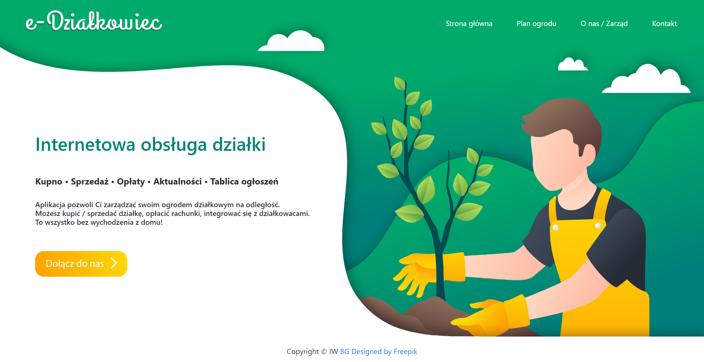

<h1>Aplikacja e-Działka</h1> 
 <em> 

Pozwala użytkownikowi zarządzać swoim ogrodem działkowym na odległość. Umożliwia kupno i sprzedaż działki, opłacanie rachunków, kontakt z zarządem oraz integrację z innymi działkowcami. 

~

Dla właściciela ogrodu - uproszczenie przekazywania informacji dla działkowiczów, prosty wgląd i weryfikacja finansów oraz zarządzanie ogrodami działkowymi
 
</em> 
 
 
 

 
<b>Użyte technologie:</b> MongoDB, Express, React JS, Node JS

 
Database name:
<b>database</b>
  

